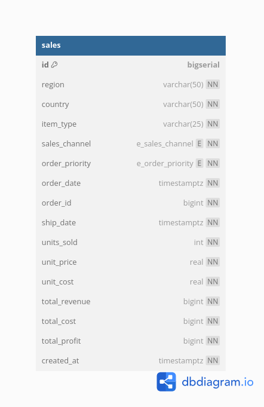

# pg-csv

Insert 5 million records into a postgres database in ~3 minutes.

## The idea

- Receive a CSV file with 5 million sales records through a POST request.
- Create an endpoint to receive this CSV file.
- Send the CSV file to a redis queue.
- Queue reads the data from the CSV file and copies it to a Postgres database.
- Send notification once all records are inserted.
- Query sales data inserted into the database.
- CSV file with 5 million sales record can be downloaded [here](https://excelbianalytics.com/wp/downloads-18-sample-csv-files-data-sets-for-testing-sales/)

## DB Schema

## Technologies

- Docker
- Gin
- Mailhog
- Postgres
- Redis

## Future implementation

- Expose GraphQl endpoints
- Use a gRPC server to serve both HTTP & gRPC requests.
- Save the CSV file to s3 or minio.
